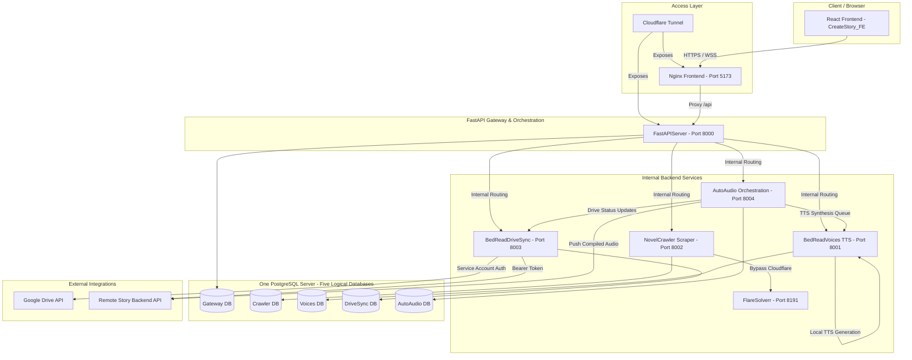

# CreateStory Monorepo

CreateStory is a unified local operations system for crawling novels, generating high-quality Text-to-Speech (TTS) audio, syncing Google Drive story folders to a remote backend, and orchestrating auto-audio production workflows. It features a React frontend and a Docker Compose microservice backend.

---

## Quick Start (Docker)

The entire backend runs in **Docker** — you do **not** install Python, FFmpeg, or Chrome on your machine. They are already baked into the service images. A fresh PC needs only a few tools, then **one command** brings up the whole stack.

> **Platform:** Windows 10/11. The setup scripts are PowerShell and write secrets to `C:\ProgramData\CreateStory\secrets\`. Give Docker Desktop ~16 GB RAM (BedReadVoices alone is capped at 4 GB).

### 1. Install prerequisites

Install these, then **restart your terminal** so `PATH` refreshes:

| Tool | Why | Install |
|---|---|---|
| **Git** | clone the repo | `winget install Git.Git` |
| **Docker Desktop** | runs the whole stack (enable the WSL2 backend) | [Download](https://www.docker.com/products/docker-desktop/) |
| **Task (go-task)** | one-command setup + runner | `winget install Task.Task` |
| **GitHub CLI** *(only if this repo is private)* | authenticates the TTS model download | `winget install GitHub.cli` |

> **Node.js is optional** — needed only for the live-reload frontend dev server (step 5). The app itself is served by an Nginx container, so you don't need Node just to run CreateStory.

### 2. Clone the repo

```powershell
git clone https://github.com/nguyenriver/CreateStory
cd CreateStory
```

### 3. Start everything (one command)

From the `Services` folder:

```powershell
cd Services
task start:fresh
```

`task start:fresh` performs the entire first-time setup for you:

1. **Generates secrets** in `C:\ProgramData\CreateStory\secrets\` (Postgres admin password, five private service DB URLs/role passwords, legacy rollback URL, JWT key, internal token, cookie key) — nothing to edit by hand.
2. **Downloads the Kokoro TTS models** (~335 MB) into `BedReadVoices/api/models/`.
3. **Builds and starts** all 5 services + PostgreSQL + FlareSolverr + the Nginx frontend.
4. **Creates your admin account** — you'll be prompted for an **email** and a **password (min 12 characters)**. That is your login.

> **Optional — skip the model download for a faster setup:** If you already have the two Kokoro model files, drop them into `Services/BedReadVoices/api/models/` **before** running `task start:fresh` — `kokoro-v1.0.onnx` (~310 MB) and `voices-v1.0.bin` (~25 MB). The setup detects valid files (by size) and skips the download automatically. You can grab them from the repo's **Releases → `models-v1.0`** tag.

> **Model download fails with a 404?** The models live on a GitHub Release that may be private. Run `gh auth login` once, then re-run `task start:fresh` (or just `task models:check`).

### 4. Open the app

| What | URL |
|---|---|
| **Frontend** | http://localhost:5173 |
| **API gateway** | http://localhost:8000/api |

Log in with the admin email/password from step 3. Crawling and TTS work out of the box.

### 5. Everyday commands

Run these from the `Services` folder:

```powershell
task --list          # show every available task
task start:bg        # rebuild + start in the background
task start           # rebuild + start in the foreground (watch logs)
task update:all      # rebuild the frontend + all services
task update:gateway  # rebuild one service (also :voices, :crawler, :sync, :audio)
task clean           # stop everything, remove containers + volumes
```

> ⚠️ `task start:fresh` wipes the secrets **and the database** — use it only for the very first run or a full reset. Afterward, use `task start` / `task update:all`.

**Live frontend development** (hot reload on http://localhost:5173):

```powershell
cd CreateStory_FE
npm install
npm run dev
```

### 6. Optional integrations

Crawling and TTS need no extra credentials. These two features do, and the app still boots without them:

- **Google Drive Sync** — a Google **service-account JSON** (set `GOOGLE_SERVICE_ACCOUNT_JSON` in `Services/BedReadDriveSync/.env`); give that service account Viewer access to your shared Drive folder.
- **AutoAudio publishing** — the Main BE API base URL + token.

---

## System Architecture

CreateStory is designed as a modular system consisting of a React SPA (served via Nginx) and a central FastAPI Gateway proxying requests to specialized downstream services.



### Communication Flow
1. **Frontend**: The React application sends requests either directly to `localhost:8000` (in dev) or via the Nginx-proxied `/api` endpoint.
2. **Gateway**: `FastAPIServer` handles CORS, security headers, token-based authentication, and maps all `/api/drive-sync/*`, `/api/tts/*`, `/api/crawl/*`, and `/api/auto-audio/*` paths to their respective backend services.
3. **Database ownership**: One PostgreSQL server hosts five logical databases. Each service has a restricted role that can connect only to its own database, owns its migrations, and obtains another service's data through protected APIs.

This is the recognized **API Gateway + Database-per-Service microservices** pattern. A physical PostgreSQL process remains shared for operational simplicity; logical database and role boundaries prevent table-level coupling.

---

## Monorepo Layout

```text
CreateStory/
  CreateStory_FE/              React + TypeScript frontend
  Services/                    Orchestrated docker compose backend stack
    AutoAudio/                 Auto-audio discovery and orchestration pipeline
    BedReadDriveSync/          Google Drive folder scanning and synchronization
    BedReadVoices/             Kokoro TTS generation service (ONNX GPU/CPU runtime)
    FastAPIServer/             Central API gateway
    NovelCrawler/              Novel crawling (Scrapy, Selenium, FlareSolverr)
  Exports/                     Archived configuration files and build exports
```

---

## Architectural Decisions & Resiliency (Interview Prep)

This section documents the engineering rationale behind the CreateStory microservice architecture, specifically designed to address common system design questions and interview scenarios.

### 1. Monolith vs. 5-Microservice Split (Why not 1 service?)
Instead of compiling everything into a single monolithic backend, the system is decomposed into 5 distinct services for several key reasons:

* **Resource Isolation & Safety**:
  * **BedReadVoices** is highly CPU/GPU-bound due to ONNX runtime neural text-to-speech inference. It caches model weights in memory (~1 GB VRAM/RAM).
  * **NovelCrawler** runs headless Chromium instances via undetected-chromedriver, which is prone to memory leaks, heavy PID consumption, and CPU spikes.
  * *Benefit*: If a Chromium process leaks memory and crashes `NovelCrawler`, or if a massive TTS queue exhausts VRAM in `BedReadVoices`, the central API Gateway (`FastAPIServer`) remains responsive, and other services (e.g., Drive syncing) continue to run normally.
* **Scale-to-Hardware Matching**:
  * The TTS service (`BedReadVoices`) can be deployed on a node with an Nvidia GPU for CUDA acceleration, while the gateway and scrapers can run on lightweight, cheaper CPU-only nodes.
* **Network & Security Egress Boundaries**:
  * `NovelCrawler` can use conservative rate limits and approved egress routing separate from services such as `BedReadDriveSync`, which connects to Google APIs. Separating them allows fine-grained security policies, dedicated routing tables, and auditable outbound settings for each egress path.

### 2. Request Lifecycles & End-to-End Tracing
Here is how data flows through the pipeline under the two most common user requests:

#### A. Novel Crawling & Combined Export Flow
1. **Trigger**: User pastes a Wattpad URL into `CreateStory_FE` and clicks "Start Crawl".
2. **API Proxy**: Frontend sends a `POST /api/crawl/start` to the Gateway (`FastAPIServer`).
3. **Gateway Routing**: Gateway proxies the payload directly to `NovelCrawler` (port 8002).
4. **Scrape Initiation**: `NovelCrawler` instantiates a Scrapy crawler process. If the target is Wattpad, it requests a persistent headless Chrome session through the Undetected-Chromedriver handler to bypass the Cloudflare challenge.
5. **Progress Streaming**: `NovelCrawler` streams live log events back to the Gateway, which broadcasts them to `CreateStory_FE` via Server-Sent Events (SSE) `GET /api/crawl/stream`.
6. **Persistence**: Crawled chapters are formatted as text, JSON, or markdown and saved to the shared Docker volume `novel_crawler_output`. Metadata is committed to the shared PostgreSQL database.
7. **Export/Combine**: The user calls `POST /api/results/{crawl_id}/combine`. The Gateway forwards this to `NovelCrawler`, which combines individual chapter markdown files into a single master document, ready for download.

#### B. Auto-Audio Discovery & Synthesis Flow
1. **Daemon Loop**: The `AutoAudio` orchestration worker runs a background daemon thread that queries the remote story backend API to discover published stories that are missing audio.
2. **TTS Dispatching**: For each missing chapter, `AutoAudio` sends batch synthesis requests to `BedReadVoices` (port 8001).
3. **Synthesis Queue**: `BedReadVoices` places the jobs in its persistent FIFO queue (`jobs.json`) and processes them concurrently up to the `KOKORO_CONCURRENCY` limit. Text segments are converted into raw WAV audio using the Kokoro ONNX model.
4. **Polling & Completion**: `AutoAudio` polls `BedReadVoices` for status. Once a batch is completed, it pulls the raw WAV files.
5. **Compression**: `AutoAudio` executes an in-container FFmpeg subprocess to compress the raw WAV files into highly optimized Opus format (targeting 48kbps, capped at 20MB).
6. **Publishing**: `AutoAudio` requests a presigned upload URL from the remote backend API, uploads the Opus file, and calls the remote `/complete` endpoint to publish the chapter's audio.

### 3. Failure Modes & Failure Isolation (What breaks if...?)

| Service Failure | Impacted Features | Resilient / Unaffected Features |
|---|---|---|
| **NovelCrawler** is dead | Users cannot scrape new novels, TOCs, or view live logs. | Existing scraped text can still be converted to TTS, and Google Drive syncing remains fully functional. |
| **BedReadVoices** is dead | TTS jobs will fail or remain queued. No speech synthesis is possible. | Novel crawling, result file downloads, and Google Drive folder syncing are unaffected. |
| **BedReadDriveSync** is dead | Google Drive folder scanning, uploadability checks, and updates to the remote backend are paused. | Novel scraping, manual/automatic TTS synthesis, and settings updates work fine. |
| **AutoAudio** is dead | Automatic background discovery and audio generation pause. | Manual operations via the UI (crawling, manual batch TTS, and GDrive syncing) continue to work normally. |
| **FastAPIServer** is dead | **System Outage**: The single entry point is down. The frontend UI cannot talk to any microservice. | Downstream internal states (e.g., active crawl sessions in NovelCrawler or active TTS synthesis in BedReadVoices) continue running inside their Docker containers, but their results cannot be queried. |

---

## Services & Core Components

### 1. FastAPIServer (API Gateway & Gateway Coordinator)
* **Port**: `8000` (Exposed to host)
* **Technology**: FastAPI, Pydantic, Alembic
* **Key Roles**:
  * Proxies API endpoints to downstream microservices.
  * Owns authentication plus UI/crawler preferences and composes the public settings contract from worker-owned settings.
  * Hosts development utilities (e.g. database reset/cleanup endpoints in non-production environments).

### 2. BedReadVoices (Text-to-Speech Engine)
* **Port**: `8001` (Internal only)
* **Technology**: FastAPI, Kokoro ONNX, ONNX Runtime (CUDA / CPU), soundfile
* **Key Roles**:
  * Provides GPU-accelerated speech synthesis (with CPU fallback).
  * Supports **45+ voices** across 6 languages (US/UK English, French, Italian, Japanese, Mandarin).
  * Offers **voice blending** (e.g., mixing voices with weight ratios like `af_sarah,am_adam:60:40`).
  * Manages a job queue supporting single-chapter and batch (story-wide) ZIP downloads.

### 3. NovelCrawler (Novel Web Scraper)
* **Port**: `8002` (Internal only)
* **Technology**: FastAPI, Scrapy, Selenium with `undetected-chromedriver`, BeautifulSoup
* **Key Roles**:
  * Crawls novels from Wattpad, NovelWorm, and ScribbleHub.
  * Employs headless Chrome + undetected-chromedriver to bypass Cloudflare anti-bot checks on Wattpad.
  * Integrates with FlareSolverr inside Docker to solve Cloudflare clearance challenges on ScribbleHub.
  * Features a robust rate-limiting retry mechanism to guarantee 100% completion of rate-limited chapters.

### 4. BedReadDriveSync (Google Drive Sync Bridge)
* **Port**: `8003` (Internal only)
* **Technology**: FastAPI, Google Drive API, Google Service Accounts, HTTPX
* **Key Roles**:
  * Recursively scans Google Drive folders matching status prefixes (`DONE_`, `EXTENDED_`, `ING_`, `INCOMPLETE_`).
  * Validates chapter file naming (`Chapter X - Title.md`), order, and layout checks.
  * Parses metadata files (`synopsis.md`, `tags.md`, `free.md`, `Category.md`).
  * Uploads new stories (`DONE_`) or appends new chapters (`EXTENDED_`) to the remote backend.

### 5. AutoAudio (Auto-Audio Orchestrator)
* **Port**: `8004` (Internal only)
* **Technology**: FastAPI, Uvicorn, FFmpeg
* **Key Roles**:
  * Background daemon that discovers stories missing audio in three distinct phases (Priority Dashboard -> Paginated Discovery -> Recently Updated).
  * Generates raw WAV chapters via `BedReadVoices`, compresses them using FFmpeg to Opus format (targeted at ~48kbps, capped at 20MB), and uploads them directly to the remote backend using presigned URLs.

---

## Configuration & Environment Settings

### Docker Compose Overrides (`.env`)
If you need custom variables (such as changing the model directory path), copy `Services/.env.example` to `Services/.env` and edit:

| Variable | Default Value | Description |
|---|---|---|
| `KOKORO_MODELS_DIR` | `./BedReadVoices/api/models` | Local directory containing ONNX models |
| `MAX_QUEUED_JOBS_GLOBAL` | `300` | Global TTS worker queue limit |
| `DEV_MODE` | `false` | Enables database cleanup/dev routes |
| `ENVIRONMENT` | `development` | Setting to `production` hard-disables all dev API routes |
| `DRIVE_SYNC_JOB_WORKERS` | `2` | Stories processed concurrently by the persistent DriveSync queue |
| `DRIVE_SYNC_CHAPTER_PREFETCH_WORKERS` | `4` | Per-story chapter prefetch workers |
| `DRIVE_SYNC_CHAPTER_WINDOW_SIZE` | `8` | Chapters retained in each bounded processing window |
| `DRIVE_SYNC_METADATA_WORKERS` | `8` | Metadata update worker limit |
| `DRIVE_SYNC_METADATA_DOWNLOAD_CONCURRENCY` | `8` | Metadata download limit |

### Downstream Service URL Overrides
Downstream endpoints can be adjusted in the gateway environment via a JSON string or direct env variables:
```env
SERVICE_URLS={"FastAPIServer":"http://fastapi_gateway:8000","NovelCrawler":"http://novel_crawler:8002","BedReadVoices":"http://bedread_voices:8001","AutoAudio":"http://auto_audio:8004","BedReadDriveSync":"http://bedread_drive_sync:8003"}
```

Workers do not call FastAPIServer to continue their work. BedReadVoices and AutoAudio obtain external API configuration from DriveSync's protected internal API; AutoAudio calls Voices and DriveSync directly. A Gateway rebuild therefore pauses new frontend requests and polling but does not stop active worker jobs.

### Migrating an existing shared database

From `Services`, use `task migration:plan`, then schedule a maintenance window and run `task migration:apply` before any routine rebuild with this version. The apply task refuses active jobs/non-empty targets, captures the currently running images for rollback, creates a checksummed backup in `C:\ProgramData\CreateStory\backups`, copies and validates all owned data, and keeps the legacy DB untouched. Before reopening traffic, a failed cutover can be restored with `task migration:rollback`. Full details are in [`Services/README.md`](Services/README.md#shared-database-migration-runbook).

---

## Google Drive Folder Conventions

For the Google Drive sync to detect, parse, and upload stories properly, the Drive folders must follow strict naming and layout rules.

### Folder Prefixes
* `DONE_My_Story_Title`: Scanned for upload. Triggers a new story creation if it doesn't exist.
* `EXTENDED_My_Story_Title`: Used to add new chapters to a story that is already uploaded.
* `ING_My_Story_Title` / `INCOMPLETE_My_Story_Title`: Work-in-progress; ignored by the scanner.

### Sub-Folder Layout
```text
DONE_My_Story_Title/
  ├─ synopsis.md       # Plain text summary
  ├─ cover.jpg         # Cover image file
  ├─ free.md           # Number of free chapters (e.g. "5")
  ├─ tags.md           # Tag list, one tag per line
  ├─ Category.md       # First line = platform code ("wp", "gd"), Second line = category name
  ├─ chapters/         # Chapter directory (starts at 1)
  │   ├─ Chapter 1 - The Beginning.md
  │   └─ Chapter 2 - Another Day.md
  └─ chapters-extended/ # (Optional for EXTENDED_ folders) New chapters to append
      └─ Chapter 3 - The Sequel.md
```

---

## Troubleshooting

### Connectivity & CORS Errors
* **Symptoms**: UI is unable to fetch data, or CORS preflight failures appear in browser logs.
* **Solutions**:
  * Verify that `FastAPIServer` is running on `127.0.0.1:8000`.
  * If using Cloudflare Tunnel, make sure your gateway environment lists the appropriate CORS origins. The gateway's default CORS list allows `http://localhost:5173`, `http://localhost:3000`, and `https://createstory.online`.

### TTS Synthesis & Model Failures
* **Symptoms**: BedReadVoices fails to boot or returns 500 when starting synthesis.
* **Solutions**:
  * Confirm that `kokoro-v1.0.onnx` and `voices-v1.0.bin` are located inside the mounted models folder.
  * Check Docker logs (`docker logs create-story-bedread-voices`). If it runs on CPU, it might trigger auto-detection: if your system does not support CUDA execution, verify `ONNX_PROVIDER` is unset or explicitly set to `CPUExecutionProvider`.

### ScribbleHub / Cloudflare Bypass Blocks
* **Symptoms**: Crawling ScribbleHub hangs or fails with rate limit errors immediately.
* **Solutions**:
  * Ensure the `flaresolverr` service container is running and healthy on the docker network.
  * Navigate to the **Settings** panel on the frontend and trigger the **Test Cookies** option under ScribbleHub. This forces FlareSolverr to solve the challenge and update the database cookie store.
  * If rate limits (HTTP 429) trigger on massive crawls, increase `SCRIBBLEHUB_DOWNLOAD_DELAY` to `0.5` or higher in `NovelCrawler/.env`.

### Google Drive Sync Errors
* **Symptoms**: Drive scanning shows no files, or sync jobs fail with authentication errors.
* **Solutions**:
  * Double check that the Google service account JSON file exists at the path specified in your credentials configuration.
  * Ensure that the Google service account email has **Viewer / Reader** access to the shared root Google Drive folder containing your stories.
  * Confirm that your chapter markdown files follow the strict format: `Chapter <Number> - <Title>.md`.

